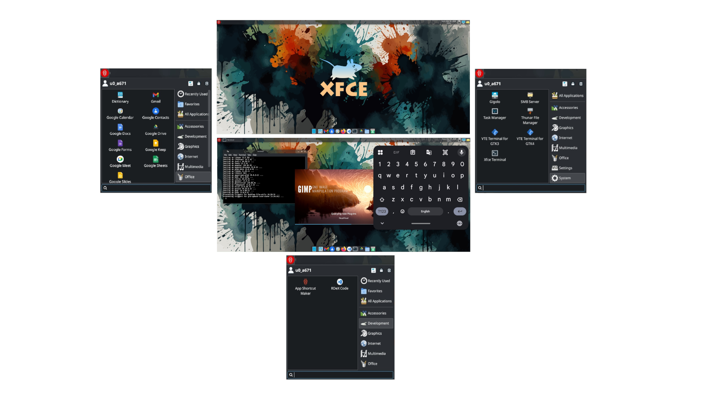

# RDeX


**RDeX (RedMagic Desktop eXperience)** is a lightweight **XFCE desktop environment for Termux** designed to run natively on Android without proot or chroot.

RDeX allows RedMagic devices to function as a **portable desktop workstation** when connected to an external display, while still supporting normal use of your phone.

The project builds on the Termux ecosystem and integrates development tools, network services, Android storage access, and desktop utilities into a deterministic provisioning system.

---



---

## How RDeX Works

RDeX turns a RedMagic phone into a lightweight desktop host using the Termux ecosystem. The setup is 162 MB, once all packages are installed it takes up about 3.50 GB of space on your device, keep in mind thats just for the Desktop Workstation, without taking into account any other packages you may have installed.

```
Android Device
      │
   Termux
      │
 Termux:X11
      │
   XFCE
      │
External Display (Console Mode)
```

Phone screen → Android apps, camera, messaging, etc.  
External display → desktop workspace

---
### Pre-Reqs
---

You can get all 3 of these from F-Droid or Droidify, but I'd recommend the GitHub version since F-Droid/Droidify updates lag behind the GitHub version.

- Termux - https://github.com/termux/termux-app
- Termux:X11 - https://github.com/termux/termux-x11
- Termux:Widget - https://github.com/termux/termux-widget

---

# Install RDeX

The following instructions assume a **fresh installation of Termux**.

Inside **Termux** run:

```
termux-setup-storage
pkg install git
cd ~/storage/shared
git clone https://github.com/vee63b/RDeX.git
cd RDeX
bash initial_bootstrap.sh
```

After running `termux-setup-storage`, the only package installed manually is **git**.

The system is **not updated or upgraded at this stage**, and this is intentional.

The `initial_bootstrap.sh` script:

- adds the **TUR repository**
- updates all repositories
- upgrades all packages

Git is installed early only so the repository can be cloned.

There are a few prompts during installation, so keep an eye on the terminal.

---

# Launching RDeX (Termux:Widget)

RDeX is designed to be launched using **Termux:Widget**, allowing the desktop to start directly from the Android home screen without opening the Termux terminal.

During installation, RDeX installs launcher scripts to:

`~/.shortcuts`

This directory is used by **Termux:Widget**.

## Recommended Launch Method

1. Install **Termux:Widget**
2. Add a **Termux widget** to your Android home screen
3. Select the script `launch_rdex.sh`

This launches the RDeX desktop environment directly. Remember to log out of the desktop when you're done with it to cleanly exit the script.

## Manual Launch (Optional)

RDeX can also be started manually from the Termux shell:

```
rdex
```

This simply runs the same launcher script used by the widget.

---

# Core Components

RDeX is built around the following Termux ecosystem tools:

- **Termux** – Linux userspace environment  
- **Termux:X11** – X server used to display the desktop  
- **Termux:Widget** – launcher integration  

These components provide a **native desktop experience on Android**.

RDeX does **not use**:

- proot  
- chroot  
- containers  

Everything runs directly inside the **Termux userspace**.

---

# Designed for a Google Workspace Workflow

The current version of RDeX is configured around a **Google Workspace (G-Suite) productivity workflow**.

Common tools used within this current environment include:

- Google Docs
- Google Sheets
- Google Slides
- Gmail
- Google Drive
- Google Meet

---

## Browser Design

RDeX uses two browsers with different roles.

### Firefox

Firefox is the **primary browser** used for general browsing and account-based services.

Firefox is used instead of Chromium because Chromium in Termux does not support signing into and syncing a Google Chrome profile.

---

### Chromium

Chromium is included as a **lightweight browser used for web applications**.

Using Chromium application mode:

```
chromium-browser --app=<url>
```

websites can run as standalone desktop applications.

This allows tools like Google Docs and Google Sheets to behave like native desktop applications inside the XFCE environment.

---

## Planned Microsoft 365 Workflow

A **Microsoft 365 workflow configuration** is planned for a future version of RDeX.

Once implemented, the bootstrap installer will allow users to select between:

- Google Workspace environment
- Microsoft 365 environment
- Both environments

This functionality is **not yet implemented**.

---

# Designed for RedMagic Devices

RDeX is designed specifically for **RedMagic phones** to take advantage of **Console Mode (Host Mode)**.

Console Mode is accessed through **SmartCast** when an external display is connected.

This allows the device to behave like a small desktop computer when connected to:

- external monitors
- TVs
- wireless casting displays
- USB-C display outputs

When connected to an external display, the phone acts as the **desktop host**, displaying the desktop on the external display while the phone remains usable as a mobile device.

---

# Display Modes

Due to the nature of RedMagic devices, RDeX supports several display configurations.

---

## Mode 1 – On-Device Desktop

Run the desktop directly on the phone screen.

Requirements:

- Termux
- Termux:X11

Workflow:

1. Start **Termux:X11**
2. Launch RDeX using either the **Termux widget shortcut** or the `rdex` command

---

## Mode 2 – Mirrored Display

Mirror the phone screen to a TV or monitor.

Requirements:

- Termux
- Termux:X11
- screen casting in mirror mode or USB-C display output

---

## Mode 3 – RedMagic Console Mode (Recommended)

Requirements:

- Termux
- Termux:X11
- external display
- keyboard and mouse

---

# Entering RedMagic Console Mode

### Method 1 — SmartCast Extended Mode

Steps:

1. Open **SmartCast**
2. Connect to an external display
3. Launch **Termux:X11**
4. Tap the SmartCast floating icon
5. Select **Extended Mode**

Limitations:

- resolution may not match correctly
- some displays show banding due to RedMagic ultrawide aspect ratios

---

### Method 2 — Game Space Console Mode (Recommended)

Steps:

1. Open **SmartCast**
2. Connect to an external display
3. Flip the **Game Space switch**
4. The device enters **Console Mode**
5. Launch **Termux:X11**
6. Start RDeX using the widget or `rdex`

---

# Input Behavior in Console Mode
Due to Gravity X taking over KBM when in Console Mode to remap into touch input:

| Device | Behavior |
|------|------|
Mouse | right-click not available |
Keyboard | Super / Meta key unavailable |

RDeX provides alternate right-click mappings:

```
CTRL + .
ALT + .
```
Both will *Right-Click* where the mouse cursor is.

---

# Installation Pipeline

```
initial_bootstrap.sh
        ↓
install_RDeX.sh
        ↓
launch_rdex.sh
```

---

# Deterministic Desktop Restore

RDeX restores a **preconfigured XFCE desktop snapshot** instead of scripting configuration.

Location:

`assets/base_state/rdex-base.zip`

---

## Recovery / Resetting the Desktop

RDeX provisioning is **idempotent**.

If the desktop becomes misconfigured, simply run:

```
bash ~/storage/shared/RDeX/install_RDeX.sh
```

This restores the environment to its original configured state. Note, this is the same as a Chromebook Hard Reset. 

---

# Available Commands

```
rdex           -> Launch RDeX desktop
config-recap   -> Show connection & service status
start-smb      -> Start Samba server
stop-smb       -> Stop Samba server
sdcard         -> Open shared storage
shortcuts      -> Open shortcut directory
ai             -> Invoke CLI AI assistant
```

---

# Management Tools

### Termai
Within terminal you can use the command 'ai' for help. On First run it will ask you to select Gemini or ChatGPT, it will then direct you to getting your API key. Once you've provided your API key the command 'ai' becomes available for use. Keep in mind this is not a vibecode tool, more like an 'AI man' command.

---

Termai - A CLI AI Assistant
A lightweight CLI tool for AI integration in your terminal.

Usage:
-  ai [OPTIONS] "YOUR QUERY"
-  cat file.txt | ai [OPTIONS] "OPTIONAL PROMPT"

Options:
-  --config        Open configuration file
-  --debug         Enable debug mode
-  --debug-config  Print the loaded configuration (redacts keys)
-  --help, -h      Show this help message
-  --reinstall    Re-run the first-time setup

Examples:
-  ai "How do I unzip a tar file?"
-  ai --config
-  cat error.log | ai "Explain this error briefly"

---

### ADB
Platform Tools are installed so Termux is adb ready and capable. You can use it to connect to your own device via Wireless ADB, or any other Android device for that matter. I haven't tested USB but I know Wireless ADB works.Your standard adb pair > adb connect flow.

### SMB Server Control

```
start-smb
stop-smb
```

or

```
~/.shortcuts/smb_tui.sh
```

Note that there is a preconfigured shortcut in Systems to launch the TUI for the SMB server. Because of the port that SMBD uses to get around Android restrictions, the SMB can be connected to using OwlFiles on Windows, or a file explore that accepts custom SMB configurations like FXFile in the play store.

---

### Code Server

If you opted to install Code Server during the initial bootstrap, you can access it via app launcher, or by opening a web browser and navigating to:

```
localhost:8080 (locally from XFCE or Android Browser)
{ipaddress}:8080 (from any device on the same LAN)
```
you should have configured a password for your Code Server during initial bootstrap. If you forgot open up terminal and use the command 'config-recap'

---

### Status Dashboard

```
config-recap
```

Displays:

- SSH command
- SMB address
- code-server URL
- service status

---

# Application Generator

Tool:

```
url_to_app.sh
```

Creates XFCE launchers for:

- web apps
- Android apps
- custom scripts

Applications are created in:

```
~/.local/share/applications
```

---

## Launch Types

### Web App

Uses Chromium application mode:

```
chromium-browser --app=<url>
```

---

### Android App

Uses Android Activity Manager:

```
am start <package>
```

When creating an Android application launcher, the **name entered at the beginning of the generator is used as a search term**.

The script searches installed Android packages for matches.

Example workflow:

1. Enter application name (example: `meet`)
2. Installed packages are searched for matches
3. If multiple matches exist, you can select the correct package
4. The launcher is created using the selected package name

This means users **do not need to know the full Android package name**.

Android applications launched this way open on the **phone screen**, not inside the XFCE desktop.

This behavior is intentional.

Example: launching **Google Meet** opens the meeting on the phone so the camera aligns with the user during video calls.

---

### Custom Script

Creates a launcher for any executable script.

Scripts are automatically made executable using:

```
chmod +x <script>
```

To be sure though, you can always manually chmod +x your_script.sh/.py 
Scripts are launched directly from their **original location** and are **not copied**.

---

# Project Structure

```
RDeX
├── assets
│   └── base_state
│       └── rdex-base.zip
├── initial_bootstrap.sh
├── install_RDeX.sh
├── shortcuts
│   ├── Start-SMB.sh
│   ├── Stop-SMB.sh
│   ├── launch_rdex.sh
│   ├── smb_tui.py
│   ├── smb_tui.sh
│   ├── status.sh
│   └── url_to_app.sh
└── smb.conf
```

---

# Planned Improvements

Future updates will include:

- Microsoft 365 workflow configuration
- interactive environment selection in bootstrap
- full RDeX uninstaller
- possibly an "App Store" to automate pkg installation/updating/removal

---

# License

GPL-3.0
